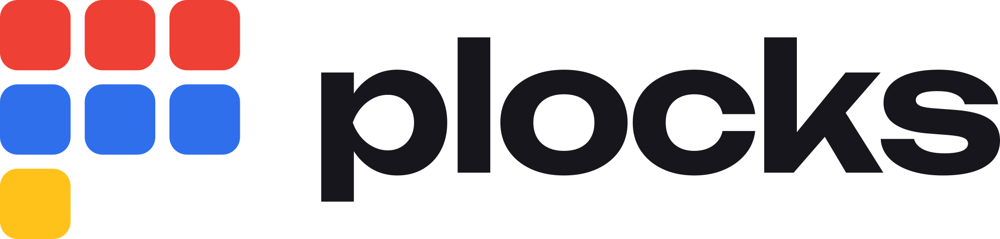

<p align="center">
  <a href="https://plocks.dev/" rel="noopener" target="_blank">
    <picture>
      <source media="(prefers-color-scheme: dark)" srcset="./brand/svg/lockup-dark.svg" />
      
    </picture>
  </a>
</p>

<div align="center">

[](https://github.com/platform-blocks/plocks/blob/HEAD/LICENSE)
[](https://discord.gg/kbHjwzgXbc)
[](https://x.com/plocks_ui)

</div>

[plocks](https://plocks.dev/) is a React Native UI component library for building intuitive, accessible, and highly customizable mobile and web applications.

## Packages

| Package | Description | Version |
| --- | --- | --- |
| [`@plocks/ui`](./packages/ui) | 90+ components — inputs, navigation, overlays, layout, theming, and more | [](https://www.npmjs.com/package/@plocks/ui) |
| [`@plocks/dates`](./packages/dates) | Calendars and date, month, year and time pickers | [](https://www.npmjs.com/package/@plocks/dates) |
| [`@plocks/charts`](./packages/charts) | 25 data visualization chart types with animations and interactions | [](https://www.npmjs.com/package/@plocks/charts) |
| [`@plocks/code`](./packages/code) | `CodeBlock` with syntax highlighting, and `Markdown` | [](https://www.npmjs.com/package/@plocks/code) |
| [`@plocks/media`](./packages/media) | `AudioPlayer`, `Video`, and sound feedback | [](https://www.npmjs.com/package/@plocks/media) |
| [`@plocks/carousel`](./packages/carousel) | A swipeable `Carousel` | [](https://www.npmjs.com/package/@plocks/carousel) |
| [`@plocks/spotlight`](./packages/spotlight) | A ⌘K command palette | [](https://www.npmjs.com/package/@plocks/spotlight) |
| [`@plocks/brands`](./packages/brands) | Brand icons and buttons | [](https://www.npmjs.com/package/@plocks/brands) |
| [`@plocks/qrcode`](./packages/qrcode) | Themeable QR codes | [](https://www.npmjs.com/package/@plocks/qrcode) |
| [`@plocks/emoji-picker`](./packages/emoji-picker) | Searchable emoji picker | [](https://www.npmjs.com/package/@plocks/emoji-picker) |
| [`@plocks/ui-snack`](./packages/ui-snack) | Curated bundle for Expo Snack examples | [](https://www.npmjs.com/package/@plocks/ui-snack) |
| [`create-plocks`](./packages/create-plocks) | Template based app generator | [](https://www.npmjs.com/package/create-plocks) |

## Installation

Start a new app from a template:

```sh
npm create plocks@latest
```

Or add plocks to an existing app:

```sh
npm i @plocks/ui
```

Add the other packages you use alongside it, e.g. `npm i @plocks/dates @plocks/charts`.

Then install the peer dependencies your app provides — on Expo, use `expo install` so the versions match your SDK:

```sh
npx expo install react-native-reanimated react-native-safe-area-context react-native-svg
```

The built-in `Icon` glyphs ship with `@plocks/ui`. See the [package README](./packages/ui/README.md#peer-dependencies) for the full peer list.

## Key features

- **Cross-platform** — iOS, Android, and Web from a single codebase
- **140+ components** — Comprehensive set of UI primitives and complex widgets
- **25 chart types** — Bar, Line, Area, Pie, Scatter, Radar, Heatmap, and more
- **Themeable** — Built-in light/dark themes with full customization support
- **Accessible** — Screen reader, keyboard navigation, and RTL support
- **Animated** — Smooth transitions powered by `react-native-reanimated`
- **Tree-shakeable** — Optimized ESM builds

## Documentation

Full documentation and examples are available at [plocks.dev](https://plocks.dev).

Full example apps are maintained in the separate `examples` checkout. The [examples gallery](https://plocks.dev/examples) links to their live web demos and source pages when the docs are built with `npm run site:build-with-demos`. Keep the two repositories as siblings; the build places the apps at `/demos/<app>/` and their source at `/demos/<app>/source.html`. The docs deployment workflow checks out both repositories and publishes them together.

- [Getting started](https://plocks.dev/getting-started)
- [Component gallery](https://plocks.dev/components)
- [Theming](https://plocks.dev/theming)
- [Accessibility](https://plocks.dev/accessibility)
- [llms.txt](https://plocks.dev/llms.txt) — Documentation index for LLMs and AI assistants,
  linking a standalone Markdown page per component, chart, hook, guide, and FAQ entry.
  [llms-small.txt](https://plocks.dev/llms-small.txt) is every API in one compact file
  (imports, own props, one example each), [llms-full.txt](https://plocks.dev/llms-full.txt)
  is everything in full; [plocks.dev/llms](https://plocks.dev/llms) explains the layout.

## Contributing

Read the [contributing guide](CONTRIBUTING.md) to learn how to set up the development environment.

Release and npm migration steps are in [RELEASING.md](RELEASING.md).

## License

This project is licensed under the [MIT License](LICENSE).
